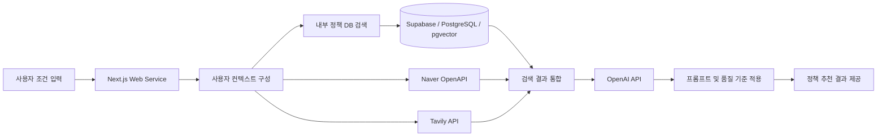
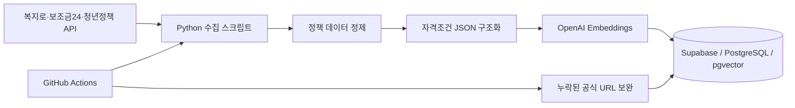

# Policy Navigator  
### AI 기반 맞춤형 공공 정책 검색·추천 서비스

> 사용자의 거주지, 연령, 가구 상황 등 개인 조건을 바탕으로  
> 신청 가능성이 높은 정부·지자체 정책을 검색하고,  
> 지원 내용·신청 조건·마감일·공식 링크를 이해하기 쉽게 제공하는 대화형 AI 서비스입니다.

## 🔗 서비스

- [Policy Navigator 서비스 이용하기](https://www.policyai.kr)

> 정책 정보는 변경될 수 있으므로 실제 신청 전 반드시 공식 공고를 확인해야 합니다.

---

## 📱 서비스 화면

<p align="center">
  
  &nbsp;&nbsp;
  
</p>

사용자가 거주지, 출생연도, 가구 상황 등의 조건을 입력하면  
AI가 조건에 맞는 정책을 검색하고 지원 내용과 신청 정보를 요약해 제공합니다.

---

## 1. 프로젝트 배경

정부와 지자체에서는 매년 다양한 복지 혜택과 지원 정책을 제공하지만,  
정책 정보가 여러 기관과 웹사이트에 흩어져 있고 공고문도 복잡해  
필요한 사용자가 자신에게 맞는 혜택을 찾기 어렵다는 문제가 있습니다.

Policy Navigator는 이러한 정보 비대칭 문제를 줄이기 위해 기획했습니다.

사용자가 여러 사이트를 직접 검색하는 대신 자신의 조건을 입력하면,

- 신청 가능성이 높은 정책
- 주요 지원 내용
- 신청 조건
- 신청 기간
- 공식 출처

를 한 번에 확인할 수 있도록 구성했습니다.

---

## 2. 핵심 기능

### 사용자 조건 기반 정책 검색

거주지, 출생연도, 가구 구성 등 사용자의 조건을 검색 쿼리에 반영해  
관련성이 높은 정책을 우선적으로 탐색합니다.

### 다중 검색 구조

하나의 검색 결과에만 의존하지 않고 다음 검색 수단을 역할별로 활용합니다.

1. **내부 정책 DB**
   - 수집·정제된 정책 데이터를 우선 검색
   - pgvector 기반 벡터 유사도 검색 적용

2. **Naver OpenAPI**
   - 내부 DB에 포함되지 않은 최신 지역 공고와 공식 링크 보완

3. **Tavily API**
   - 마감일, 지원 금액, 공식 링크가 불명확할 때 추가 검증

### AI 기반 정책 요약

검색된 정책 정보를 바탕으로 다음 항목을 이해하기 쉽게 정리합니다.

- 주관 기관
- 지원 대상
- 핵심 혜택
- 신청 조건
- 신청 기간
- 공식 신청 링크

### 검색 결과 품질 점검

사용자 조건별 검색 결과를 반복적으로 확인하며 다음 오류 유형을 중점적으로 점검했습니다.

- 이미 마감된 정책 추천
- 공식 출처가 불명확한 정보
- 사용자 조건과 맞지 않는 정책
- 검색 결과에 없는 금액이나 날짜 추측
- 동일 정책의 중복 노출
- 중요 정보가 잘린 검색 결과

---

## 3. AI 검색 품질 관리 기준

AI가 자연스러운 문장을 생성하는 것보다  
검색 결과의 정확성과 신뢰성을 유지하는 것을 우선하도록 기준을 구성했습니다.

| 품질 기준 | 적용 내용 |
|---|---|
| 근거 기반 답변 | 검색 도구에서 확인된 정책만 답변에 사용 |
| 마감일 확인 | 현재 날짜를 기준으로 마감된 정책 제외 |
| 공식 출처 우선 | 정부·지자체·공공기관의 공식 URL 우선 제공 |
| 추측 금지 | 금액·마감일·지원 조건이 불명확하면 임의로 보완하지 않음 |
| 조건 일치 확인 | 사용자의 연령·거주지와 정책 조건을 비교 |
| 약한 검색 결과 검증 | 관련성이 낮은 검색 결과는 외부 검색으로 추가 확인 |
| 중복 결과 정리 | 동일한 정책과 URL이 반복 노출되지 않도록 처리 |

> 본 프로젝트는 AI 환각을 완전히 제거한다고 주장하지 않습니다.  
> 검색 근거 제한, 공식 출처 확인, 예외 처리 기준을 통해 환각 리스크를 줄이는 것을 목표로 합니다.

---

## 4. 시스템 아키텍처



### 검색 흐름

```text
사용자 조건 입력
→ 내부 정책 DB 우선 검색
→ 최신 지역 공고 및 공식 링크 보완
→ 불명확한 정보 추가 검증
→ 검색 결과 중복 제거 및 조건 확인
→ OpenAI API를 통한 정책 요약
→ 사용자에게 결과 제공
```

---

## 5. 정책 데이터 파이프라인



### 자동 동기화

GitHub Actions의 Scheduled Workflow를 통해 다음 작업을 정기적으로 수행합니다.

- 복지로·보조금24 정책 데이터 수집
- 청년정책 데이터 수집
- 데이터 정제 및 DB 저장
- 변경된 정책 데이터 확인
- 공식 URL이 누락된 정책의 링크 보완
- 실행 로그와 단계별 성공·실패 여부 확인

### 변경 데이터 선별 처리

정책 내용의 `content_hash`를 비교해 신규 또는 변경된 정책만 선별하고,  
불필요한 중복 저장과 임베딩 API 호출을 줄이도록 구성했습니다.

### 정책 상태 관리

마감되거나 일정 기간 갱신되지 않은 정책은 DB에서 바로 삭제하지 않고  
Soft Delete 방식으로 비활성화해 기존 이력을 보존하도록 구성했습니다.

---

## 6. 기술 스택

| 구분 | 기술 |
|---|---|
| AI / Prompt | OpenAI API, System Prompt |
| Search / Retrieval | OpenAI Embeddings, RAG, Naver OpenAPI, Tavily API |
| Data Pipeline | Python, requests, 복지로 API, 보조금24 API, 청년정책 API |
| Database | Supabase, PostgreSQL, pgvector |
| Web Service | Next.js, React, TypeScript, REST API |
| Automation | GitHub Actions |
| Monitoring | Sentry, GitHub Actions Log |
| Deployment | Vercel |
| Prototype | Python, Streamlit |

---

## 7. 개발 과정

### Phase 1. Python·Streamlit 프로토타입

SIAT Python·LLM 수업의 개인 프로젝트로 시작했습니다.

초기 버전에서는 Python과 Streamlit을 활용해 다음 기능을 직접 구현했습니다.

- 사용자 조건 입력
- 정책 검색 로직
- OpenAI API 연동
- 시스템 프롬프트 작성
- 검색 결과 기반 정책 요약
- 환각 방지를 위한 기본 응답 기준

### Phase 2. 웹 서비스 확장

프로토타입을 실제 사용 가능한 웹 서비스로 확장하기 위해  
Next.js·TypeScript·Supabase 기반 구조를 적용했습니다.

웹 서비스 확장 과정에서는 생성형 AI 개발 도구를 활용했으며,  
다음 작업을 직접 수행했습니다.

- 기능 요구사항 정의
- 생성된 코드 실행 및 적용
- 코드 수정
- 기능별 동작 테스트
- 오류 로그 확인 및 문제 해결
- 검색 결과와 DB 저장 결과 검증
- 환경변수 설정 및 배포

### Phase 3. AI 검색 품질 관리

서비스 확장 이후에는 기능 추가보다 검색 결과의 품질과 운영 안정성을 중점적으로 점검했습니다.

- 마감 정책 탐지
- 공식 출처 확인
- 사용자 조건 불일치 확인
- 프롬프트 기준 정리
- 오류 유형 분류
- 예외 상황 응답 기준 작성
- 검색 도구별 역할 구분
- 데이터 동기화 상태 확인

---

## 8. 주요 프로젝트 구조

```text
policy-navigator/
├── app/
│   ├── api/
│   │   ├── chat/                 # AI 정책 검색·응답 API
│   │   ├── profile/              # 사용자 컨텍스트 처리
│   │   └── admin/                # 정책 및 운영 상태 관리
│   └── ...
│
├── lib/
│   ├── prompts/
│   │   └── policyNavigator.ts    # 시스템 프롬프트 및 응답 기준
│   ├── supabase.ts               # Supabase 연결
│   ├── embeddingCache.ts         # 임베딩 처리
│   ├── rateLimit.ts              # 요청 제한
│   └── tavilyUsage.ts            # 외부 검색 사용량 관리
│
├── scripts/
│   ├── sync_welfare.py           # 복지로·보조금24 데이터 수집
│   ├── sync_youth.py             # 청년정책 데이터 수집
│   ├── backfill_urls.py          # 누락된 공식 URL 보완
│   └── _eligibility_extractor.py # 정책 자격조건 구조화
│
├── .github/
│   └── workflows/
│       └── sync_db.yml           # 정책 데이터 정기 동기화
│
├── docs/
│   ├── images/                   # 서비스 화면
│   └── QA_GUIDE.md               # 프롬프트·QA 운영 기준
│
└── README.md
```

---

## 9. 로컬 실행

### 요구 환경

- Node.js 20 이상
- npm 10 이상
- Supabase 프로젝트
- OpenAI API Key

### 저장소 복제

```bash
git clone https://github.com/chaiworkspaxe-crypto/policy-navigator.git
cd policy-navigator
```

### 패키지 설치

```bash
npm install
```

### 환경변수 설정

프로젝트 루트에 `.env.local` 파일을 생성합니다.

```env
# AI
OPENAI_API_KEY=

# Database
NEXT_PUBLIC_SUPABASE_URL=
SUPABASE_SERVICE_ROLE_KEY=

# External Search
NAVER_CLIENT_ID=
NAVER_CLIENT_SECRET=
TAVILY_API_KEY=
```

정책 데이터 수집 스크립트까지 실행할 경우 다음 키가 추가로 필요합니다.

```env
PUBLIC_DATA_PORTAL_KEY=
YOUTH_POLICY_API_KEY=
```

> 실제 API Key와 Service Role Key는 GitHub에 업로드하지 않습니다.

### 개발 서버 실행

```bash
npm run dev
```

브라우저에서 다음 주소로 접속합니다.

```text
http://localhost:3000
```

### 코드 검사

```bash
npm run typecheck
npm run lint
```

---

## 10. 주요 한계

- 정책 내용과 신청 기간은 운영 기관에 의해 변경될 수 있습니다.
- 자격 여부는 사용자가 입력한 조건과 정책 본문을 기반으로 한 추정 결과입니다.
- 소득, 재산, 세대 구성 등 모든 자격조건을 자동으로 판정할 수는 없습니다.
- 검색 결과가 없다고 해서 실제 지원 가능한 정책이 전혀 없다는 의미는 아닙니다.
- 최종 신청 여부는 반드시 공식 공고와 담당 기관을 통해 확인해야 합니다.

---

## 11. 향후 개선 방향

- 사용자 페르소나 기반 회귀 테스트 자동화
- 검색 결과 정확성·출처 유효성 평가 지표 도입
- 프롬프트 버전 관리
- 검색 결과 오류 유형 통계화
- 관리자용 검색 품질 모니터링 화면 개선
- 정책 변경 이력 비교 기능
- 사용자 피드백 기반 검색 결과 개선

---

## 12. 프로젝트 정보

- 개발 기간: 2026.03 ~ 2026.05
- 개발 인원: 1명
- 개발 형태: 개인 프로젝트
- 개발자: 유창현
- 배포 서비스: [https://www.policyai.kr](https://www.policyai.kr)
